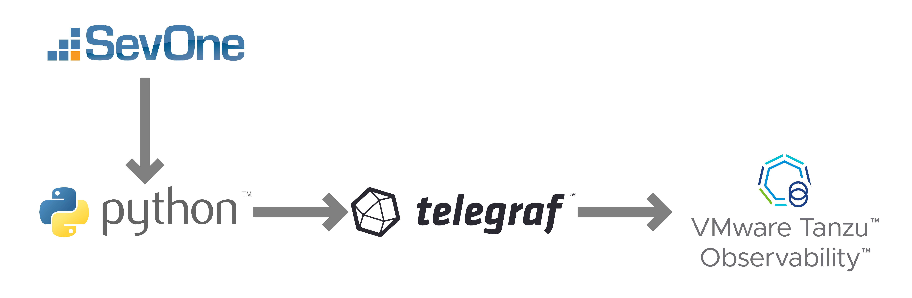

# Monitor SevOne with VMware Tanzu Observability (Wavefront) with Python and Telegraf

An unofficial project which collects metrics from [SevOne](https://www.sevone.com/), outputs them in the [Wavefront data format](https://docs.wavefront.com/wavefront_data_format.html), and sends them to [VMware Tanzu Observability](https://tanzu.vmware.com/observability).

> Warning - Running this project can result in very large numbers of API requests creating a heavy load on SevOne. Use with caution!

## How it works

### Data flow



1. Telegraf runs Python script (on a set schedule).
2. Python script authenticates against SevOne API using username/password.
3. Python script gathers all metrics available from SevOne (limitable by permissions limiting what devices the SevOne account has access to).
4. Python script outputs metrics to telegraf in [Wavefront data format](https://docs.wavefront.com/wavefront_data_format.html).
5. Telegraf sends metrics to [VMware Tanzu Observability](https://tanzu.vmware.com/observability) via a Tanzu Observability proxy.

### Collection Strategies

There are two collection strategies to use.

#### Bulk Collection

This strategy is the default strategy and will collect all metrics from all devices that are made available through the SevOne API. This collects the most metrics but this can take a long time to execute if you have a large number of devices (2+ hours).

#### Specific Collection

This strategy will only collect a set of metrics that are specified within the `SevOne_Specific/indicators.yaml` file. As this is only collecting a small subset of all available metrics this script will run in a matter of seconds. To use this script you must edit the connection variables in the same way as bulk collection, but you must also add the metrics to collect in the `indicators.yaml` file.

Ensure you point the Telegraf conf to the correct Python script for the collection strategy you wish to use. You can use both strategies at the same time by using two copies of the Telegraf Script.

## Getting started

### Prerequisites

- Linux instance with:
  - Telegraf (Telegraf install instuctions in the [Telegraf documentation](https://docs.influxdata.com/telegraf/))
  - Python 3.8+
  - Network access to SevOne API and Tanzu Observability
  - Git (or ability to manually copy files into the machine)
- SevOne username/password with API access

### Setup Python

#### Clone Git repository

Download the files from the Git repository into the Telegraf directory (usually `/etc/telegraf/telegraf.d`).

```bash
cd /etc/telegraf/telegraf.d
git clone https://github.com/GShuttleworth/VMware-Tanzu-Observability-SevOne-Integration
```

#### Virtual environment

It is best practice to run the python scripts inside a [Python virtual environemt](https://docs.python.org/3/tutorial/venv.html).

To create a Python virtual environment named `venv`:

```bash
python3 -m venv venv
```

> You can check the version of Python in the virtual environment by:
> Enter the virtual environment:
>
> ```bash
> activate venv/bin/activate
> ```
>
> Check Python version:
>
> ```bash
> python -V
> ```

#### Install Python requirements

To install Python dependencies:

1. Enter Python virtual environment:
   ```bash
   activate venv/bin/activate
   ```
2. Install requirements from `requirements.txt` file.
   ```bash
   pip install -r requirements.txt
   ```
3. Exit Python virtual environment:
   ```bash
   deactivate
   ```

#### Script configuration variables

The Python script `SevOne.py` has a number of configuration variables that need editing.

They are at the top of the script:

```python
# ****** Edit Config ******
url = "https://example.com/api/v2"  #  SevOne API URL - e.g. "https://example.com/api/v2" - only tested with SevOne API v2
username = "user"
password = "password"
api_request_page_size = 20  # The size of the requested page, defaults to 20; limited to a configurable maximum (max 10000 by default)
time_interval = 300  # How far back in time to get data from (in seconds) - this should equal to how often this script runs.
total_timeout = 9000  # Timeout for all API calls to be made (total) - seconds.
ssl = True  # Should SSL certificates be checked? This should be set to True in production?
tcp_force_close = True  # Force the TCP connection to be closed and re-opened every call?
# ****** Stop Editing Config ******
```

Follow comments in code for instructions on how to set these variables.

### Setup telegraf

#### Configure Tanzu Observability proxy

Telegraf sends data to Tanzu Observability using a proxy. Follow [these instructions](https://docs.wavefront.com/proxies_installing.html) to install a proxy into Telegraf.

#### Telegraf configuration

Telegraf needs a configuration file to be installed. This is included as `SevOne.conf`

```
[[inputs.exec]]
    command = "/etc/telegraf/telegraf.d/venv/bin/python /etc/telegraf/telegraf.d/SevOne.py"
    data_format = "wavefront"
    interval = "30m"
    timeout = "30m"
```

The interval should match the interval that is set in the Python configuration variables mentioned above. This should also be set to a greater time than the script takes to run.

#### Starting Telegraf

You can test your configuration is correct by running:
`telegraf --test`

> This could take a long time to complete depending on how much data is coming from SevOne.

Start/Restart the Telegraf service. This will be different depending on Linux distributions but is likely to be either:

```bash
service telegraf restart
```

or

```bash
systemctl restart telegraf
```

> May need to use sudo for this.

<!-- ## Troubleshooting
### SSL certificates
### API request page size
### TCP conection limits
### Run time

## Potential pitfalls -->
